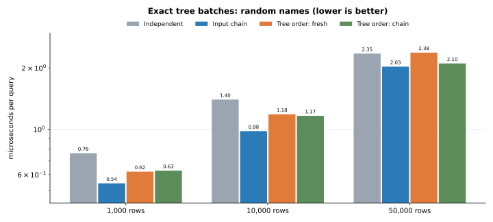
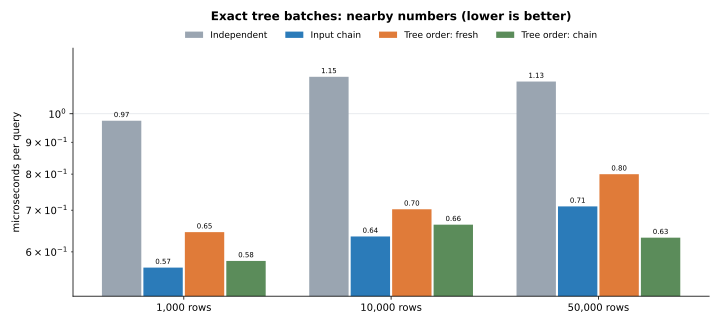
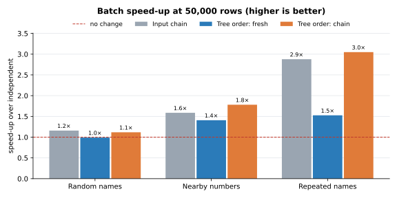
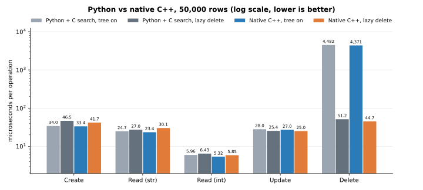
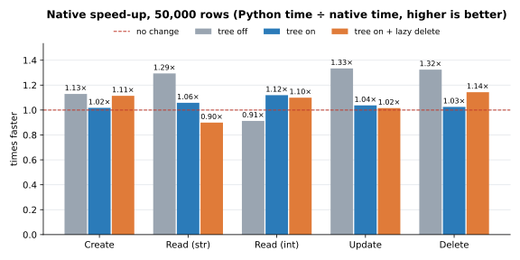

# SiQL (Simple Query Language)


### *A Python API for local tables and data access/searching much like [SQLite](https://sqlite.org/)*
This Python library is intended to make data access and usage simpler with single calls and query chains

## Installation
Requires CPython 3.11+. No third-party runtime dependencies. All implementation modules compile to C++
extensions using Cython; searching also uses the C engine. Wheels contain native extensions for their Python
version and platform. Building from source requires a C/C++ compiler (MSVC on Windows, GCC or Clang on Linux/macOS).
```
pip install SiQL
```

For a local native build and the existing test suite:
```
python -m pip install -e .
python -m unittest discover -s src/siql/tests -t src -v
python -m build
```

`python tools/check_native.py` verifies every implementation loaded as an extension.
`python tools/test_wheel.py dist/<wheel-filename>.whl` installs a wheel into a temporary directory and runs
the same tests against that installed distribution.

The maintained Python syntax is the input to Cython's C++ compiler, rather than a handwritten standalone C++
API. Generated C++ is under `build/cython/`; installed wheels keep only package exports and `python -m` launchers
as Python files, including a binding shim for `Table.find` to preserve `unittest.mock` autospec behavior.
Each implementation module loads directly from a `.pyd` (Windows) or `.so` (Linux/macOS).
The Python API and table file format remain the same. `SIQL_PURE_PYTHON=1` selects the reference search
algorithms for comparison; those algorithms also run as compiled C++ in the native distribution.

SiQL has three layers. Use only the ones you need: `import siql` loads just the library, the
interpreter loads the first time it's used, and the server only when you import `siql.server`.

## Command line
```
python -m siql "CREATE TABLE people (name str, age int)"
python -m siql "INSERT INTO people VALUES ('Ann', 31), ('Bob', 25)"
python -m siql "SELECT * FROM people WHERE age > 30"
python -m siql -d data "SHOW FILES"          # -d: folder of table files (default: current folder)
python -m siql -f setup.sql                  # run a script file
python -m siql                               # interactive shell (also installed as `siql`)
```
Separate several statements with `;`. Exit code is 1 if a statement fails.

## 1. Python library
```python
from siql import Table, Database

db = Database("data")                       # folder of .siql table files
people = db.create("people", name=str, age=int)
people.add(name="Ann", age=31)
db.rename("people", "staff")
db.copy("staff", "backup")
db.table("staff").compact()                 # rewrite the file without its change history
print(db.table("staff"))
```

### Search tree
Every `Table` keeps a search tree by default (`Table(tree=True)`), in layers: column name, then the first
character of a string or first digit of a number, then the table's own `Row` and `Cell` objects.
Inside each string or number branch, values are also kept in a skip list: each new value gets a random height and
joins that many "express lanes", placed by comparing it with the values already there. A lookup runs along the
sparsest lane and drops down, jumping over most of the branch, so it takes about log(n) comparisons instead of
checking every value. Values that can't be ordered (`None`, lists, `nan`, ...) sit in their own branch and are checked
one by one.
`find`, `select`, `editByName` and the interpreter's `WHERE col = value` use it instead of scanning every row.
It's kept current on every change, including direct `cell.value = ...` assignments, and rebuilt when a table loads.
```python
people.index["name"]["A"]                   # rows whose name starts with "A"
people.find("name", "Ann")                  # indices of matching rows
people.tree = False                         # discard the tree (set True to rebuild it)
```

#### Chained batch tree searches
`find_batch` searches exact values through the existing tree. It groups queries by branch, orders nearby
tree keys together, and keeps a temporary skip-list search finger for that batch. Nearby forward queries
ascend enough lanes to span the next target, then descend from saved predecessors; wider jumps switch
directly to the saved express lanes. A backward
query starts a fresh search. The finger is discarded when the batch ends, so subsequent edits cannot
leave a stale cursor. Matches always use exact key equality.

```python
queries = ["Ann", "Bob", "Anne", "Ann"]
matches = people.find_batch("name", queries)
assert matches == [people.find("name", value) for value in queries]

# Compare ordering strategies and independent traversal within the batch:
unsorted = people.find_batch("name", queries, order="input")
fresh = people.find_batch("name", queries, chained=False)
```

The returned list stays in input order, including duplicate queries and empty lists for misses.
`order="tree"` is the default: lexical order for strings and numeric order for numbers, within each
branch. `order="input"` groups by branch without sorting its queries. Unordered/custom values use
the existing exact fallback, lazy deletes are purged before traversal, and `tree=False` uses
independent scans.

Tree ordering adapts traversal to batch density: it reuses a finger when a branch receives at least
eight queries and the query count is at least 1/64 of its cell count; shorter or sparser groups use
fresh seeks. This heuristic avoids spending more on cursor maintenance than the search saves.
`chained=False` always uses fresh paths. Input ordering reuses a finger on forward seeks.





At 50,000 rows with 300-query batches:

| Workload | Independent (µs/query) | Tree order + chain (µs/query) | Speed-up |
|---|---:|---:|---:|
| Random names | 2.35 | 2.10 | 1.12× |
| Nearby numbers, shuffled | 1.13 | 0.63 | 1.78× |
| Repeated names | 1.07 | 0.35 | 3.05× |

All batch modes matched independent exact searches. Part of the gain over independent calls comes
from batching calls and branch work; the fresh-path comparison isolates the additional traversal benefit.

Measured on 2026-10-09 using native SiQL, Python 3.14.4, Linux (WSL2), Intel Core Ultra 7 165U.
Tables have random eight-letter names and sequential numbers. Nearby queries are 300 shuffled
contiguous numbers within one branch; repeated queries sample eight names. Timings are medians of
nine timed passes, each containing twenty calls to the warm batch, including ordering and restoring
result order. Repeating each batch within a timing pass reduces overhead and short-timer noise.
These measurements use a different workload and warm-up procedure from the earlier single-query
graphs. Raw timings and batch sizes 8, 32, 128, and 512 are in
[batch_results.json](docs/benchmarks/batch_results.json). Reproduce with `python benchmarks/batch.py`;
`--quick` runs a shorter comparison and `--replot` redraws the graphs. Results depend on workload
and batch size; small differences can reflect timing noise.

#### Lazy delete
`Table(lazy_delete=True)` (off by default) queues the tree's cleanup for deleted rows instead of doing it at once.
The row still leaves `rows`, `cols` and the file immediately, so nothing else sees it. In the tree, each of its
cells is queued under the branch it sits in; a search unlinks the queued cells of just the branches it reads, before
reading them, so a lookup never sees a deleted row and never checks branches it doesn't need. Lookups also correct
row positions for queued deletes instead of rebuilding the position map after every delete. The queue empties
itself if it grows past the size of the table, and `table.purge()` empties it on demand. It can also be switched
at any time with `table.lazy_delete = True`.

Without the tree (`tree=False`), `lazy_delete` has no effect: there's no tree cleanup to put off, so deletes work
exactly as normal. Turning the tree on later builds it from the current rows, and lazy deletes apply from then on.

Only the tree's cleanup waits; the delete itself never does. Each delete is written to the table file when it's
made, as the same line it would be without lazy delete, and the queue exists only in memory. So nothing has to run
at shutdown: a process can exit, or be killed, with deletes still waiting, and the next load replays the file
without those rows and builds the tree without them.

#### Performance: tree off vs on vs lazy delete, and SQLite
Each operation was timed on tables of 1,000, 10,000 and 50,000 rows (`name` = random 8-letter string,
`n` = row number), with 300 operations of each kind, taking the median of 3 runs. SiQL ran with all
implementation modules compiled to C++ and the C search engine enabled. SQLite (3.46.1, through
Python's `sqlite3`) ran the same steps with every statement saved on its own (autocommit) and
`synchronous=OFF`. "SQLite, indexed" also has an index on each column.

| Operation | What's timed in SiQL | What's timed in SQLite |
|---|---|---|
| Create | `table.add(...)`, one row at a time, each saved to the file | `INSERT`, one row per statement |
| Read (str) / Read (int) | `table.find("name", value)` / `table.find("n", value)` | `SELECT rowid ... WHERE name = ?` / `n = ?` |
| Update | `table.editByName("name", old, new)` | `UPDATE ... SET name = ? WHERE name = ?` |
| Delete | `table.find(...)` then `DropRow` for the match | `DELETE ... WHERE name = ?` |


| Operation | Rows | Tree off (µs/op) | Tree on (µs/op) | Tree on + lazy delete (µs/op) | SQLite (µs/op) | SQLite, indexed (µs/op) |
|---|---:|---:|---:|---:|---:|---:|
| Create | 1,000 | 24.3 | 24.1 | 22.8 | 13.5 | 18.4 |
| Create | 10,000 | 24.6 | 27.5 | 28.4 | 15.9 | 21.0 |
| Create | 50,000 | 32.4 | 33.4 | 41.7 | 16.9 | 23.6 |
| Read (str) | 1,000 | 14.8 | 1.6 | 1.7 | 32.9 | 4.5 |
| Read (str) | 10,000 | 175.6 | 6.8 | 6.3 | 293.2 | 5.3 |
| Read (str) | 50,000 | 1,089.4 | 23.4 | 30.1 | 1,528.3 | 5.4 |
| Read (int) | 1,000 | 11.9 | 1.2 | 1.3 | 21.2 | 4.1 |
| Read (int) | 10,000 | 139.3 | 3.1 | 3.3 | 202.7 | 4.9 |
| Read (int) | 50,000 | 1,181.3 | 5.3 | 5.8 | 1,061.3 | 5.1 |
| Update | 1,000 | 32.0 | 23.2 | 16.0 | 43.2 | 18.5 |
| Update | 10,000 | 200.1 | 22.0 | 23.8 | 348.8 | 25.0 |
| Update | 50,000 | 1,237.1 | 27.0 | 25.0 | 1,575.0 | 28.4 |
| Delete | 1,000 | 27.9 | 59.2 | 19.6 | 38.2 | 17.6 |
| Delete | 10,000 | 176.1 | 583.6 | 27.3 | 318.6 | 20.3 |
| Delete | 50,000 | 1,302.7 | 4,371.2 | 44.7 | 1,667.2 | 25.5 |

These measurements show:

- Reads and updates are 1.4–222× faster with the tree than without across the tested sizes.
- At 50,000 rows, tree-on integer lookups take 5.3 µs versus
  5.1 µs for indexed SQLite; updates take
  27.0 versus 28.4 µs.
- String lookups include building the row-position map on their first lookup. Integer lookups run next and
  reuse it. These are workload averages, not measurements of warmed-up lookups alone.
- At 50,000 rows, lazy deletes take 44.7 µs versus
  4,371.2 µs with the plain tree, a 97.7×
  improvement. The plain tree rebuilds its position map after each deletion in this workload.

#### Native C++ compared with the previous Python implementation
The previous implementation at commit `bd20da941323` was rerun on the same
machine, using the same Python version, data, C search engine, and benchmark settings. The runs were
sequential. This compares compiling the rest of SiQL to C++ while keeping the C search engine in both runs.
Speed-up is previous Python time divided by native time: above 1× is faster; below 1× is slower.




| Operation | Previous Python, tree on (µs/op) | Native C++, tree on (µs/op) | Tree-on speed-up | Lazy-delete speed-up |
|---|---:|---:|---:|---:|
| Create | 34.0 | 33.4 | 1.02× | 1.11× |
| Read (str) | 24.7 | 23.4 | 1.06× | 0.90× |
| Read (int) | 6.0 | 5.3 | 1.12× | 1.10× |
| Update | 28.0 | 27.0 | 1.04× | 1.02× |
| Delete | 4,482.5 | 4,371.2 | 1.03× | 1.14× |

Tree-on speed-ups at 50,000 rows range from 1.02× to 1.12× across these operations.
Compilation does not improve every operation in this run. File writes, Python object comparisons, and
table-file parsing still contribute to the timings. Only medians were recorded, so small differences may
reflect run-to-run noise. These results describe this workload and machine.

#### Storage


| Rows | siql (MB) | SQLite (MB) | SQLite, indexed (MB) |
|---|---:|---:|---:|
| 1,000 | 0.04 | 0.03 | 0.07 |
| 10,000 | 0.46 | 0.19 | 0.48 |
| 50,000 | 2.38 | 0.96 | 2.48 |

At 50,000 rows, SiQL's file is 2.5× the size of unindexed SQLite's. Its readable text repeats
column names on every row; SQLite stores rows in binary. SiQL's search tree lives in memory and is rebuilt
when a table loads, while SQLite keeps its indexes in the file. SiQL keeps the whole table in memory;
SQLite reads from disk as needed. Memory use was not measured.

#### Reads and writes while deletes are waiting
The same 50,000-row table, but each operation is timed right after 1,000 random rows were deleted (untimed),
so with lazy delete those deletes are still waiting in the tree. "Read (str), again" repeats the previous
lookups, and "Delete + read" alternates deleting a random row with looking one up. Each phase starts with
a fresh batch of deletes, apart from the repeated lookups.


| Operation | Tree off (µs/op) | Tree on (µs/op) | Tree on + lazy delete (µs/op) | Lazy vs tree on |
|---|---:|---:|---:|---:|
| Read (str) | 2,244.4 | 21.5 | 25.7 | 0.84× |
| Read (str), again | 2,157.6 | 4.5 | 6.3 | 0.71× |
| Read (int) | 1,613.1 | 25.0 | 33.7 | 0.74× |
| Update | 2,413.9 | 49.5 | 70.0 | 0.71× |
| Append | 25.0 | 27.8 | 28.7 | 0.97× |
| Delete + read | 2,573.7 | 6,196.7 | 92.7 | 66.82× |

The first lookups after lazy deletes clean the branches they read. Repeated string lookups take
6.3 µs with lazy delete and 4.5 µs
with the plain tree. Mixed deleting and reading takes 92.7 µs with lazy
delete, 6,196.7 µs with the plain tree, and
2,573.7 µs without a tree. Lazy delete is
66.8× faster than the plain tree for that workload.

Measured on 2026-10-08 with SiQL 1.0.0 (native C++ modules and C search), SQLite 3.46.1,
Python 3.14.4, Linux (WSL2), Intel Core Ultra 7 165U. Raw native numbers are in
[results.json](docs/benchmarks/results.json); the same-machine Python baseline is in
[results-python.json](docs/benchmarks/results-python.json). Run `python benchmarks/crud.py` for the full
benchmark (`--quick` for a short run, `--replot` to redraw saved results).
Run `python benchmarks/compare_native.py` to redraw the native comparison graphs from both result files.

#### C search functions
The skip lists, whole-column scans (`=`, `!=`, `<`, `<=`, `>`, `>=`, `IS [NOT] NULL`, `LIKE`) and value
extraction for `ORDER BY` use the C engine in `siql._speedups`. The complete distribution also compiles
the table, persistence, parser, interpreter, and server modules to C++ using Cython.
`siql.helpers.search.SPEEDUPS` reports whether the C search engine is active. `SIQL_PURE_PYTHON=1`
selects the reference search algorithms, which are also compiled in the native distribution. The existing
tests verify both search implementations give the same answers.

The interpreter combines `WHERE` scans and tree lookups as sets of row numbers. `ORDER BY` sorts row
numbers and builds only the returned rows. Query-specific timings were not rerun for this CRUD comparison;
the tables above report the operations listed in the benchmark methodology.

## 2. Query interpreter (optional)
```python
from siql import Interpreter

db = Interpreter("data")
db.execute("INSERT INTO people VALUES ('Bob', 25), ('Cy', 40)")
print(db.execute("SELECT name FROM people WHERE age > 30 ORDER BY age DESC"))
```
| Kind  | Statements |
|-------|------------|
| Data  | `INSERT INTO t [(cols)] VALUES (...), ...`<br>`SELECT * \| cols \| COUNT(*) FROM t [WHERE] [ORDER BY col [ASC\|DESC], ...] [LIMIT n [OFFSET m]]`<br>`UPDATE t SET col = value, ... [WHERE]`<br>`DELETE FROM t [WHERE]` |
| Tables | `CREATE TABLE [IF NOT EXISTS] t (col type, ...)`, `DROP TABLE [IF EXISTS] t`<br>`ALTER TABLE t ADD col type \| DROP col \| ALTER col type \| RENAME col TO new`<br>`RENAME TABLE t TO new`, `COPY TABLE t TO new`, `TRUNCATE TABLE t`<br>`SHOW TABLES`, `DESCRIBE t` |
| Files | `USE 'folder'` (switch data folder, created if missing)<br>`SHOW FILES` (table, file path, size, row count)<br>`COMPACT [TABLE t]` (rewrite one or every table file without its change history)<br>`IMPORT 'file.csv' INTO t` (creates `t` with inferred types if it doesn't exist)<br>`EXPORT [TABLE] t TO 'file.csv'` |

`WHERE` supports `= != <> < > <= >=`, `IS [NOT] NULL`, `[NOT] IN (...)`, `[NOT] LIKE`, `AND`, `OR`, `NOT` and parentheses.
Column types: `str`, `int`, `float`, `bool`, `list`, `dict`, `any` (plus SQL aliases like `text`, `integer`, `real`).
In CSV files an empty field is NULL.

## 3. HTTP server (optional)
```
siql-server init                            # writes siql.toml
siql-server serve -c siql.toml              # or: python -m siql.server serve -c siql.toml
```
| Method | Path      | Body                  | Response                                                     |
|--------|-----------|-----------------------|--------------------------------------------------------------|
| GET    | `/health` |                       | `{"status": "ok", "version": "..."}`                         |
| GET    | `/tables` |                       | `{"tables": [...]}`                                          |
| POST   | `/query`  | `{"query": "..."}`     | `{"results": [{"columns", "rows", "rowcount", "message"}]}`  |

```
curl -X POST http://127.0.0.1:8642/query -H "Content-Type: application/json" -d '{"query": "SHOW TABLES"}'
```
Set a token (`token` in `siql.toml`, or the `SIQL_TOKEN` environment variable) to require
`Authorization: Bearer <token>` on everything except `/health`. The server listens on 127.0.0.1 by default;
set a token before binding to another address. It speaks plain HTTP, so put it behind a TLS reverse proxy if
it's reachable over a network. `USE`, `IMPORT` and `EXPORT` are disabled on the server, since they would let
clients read and write files outside the data folder.

Run it as a Linux service with systemd:
```
siql-server systemd -c /srv/siql/siql.toml --user siql -o siql.service
sudo cp siql.service /etc/systemd/system/
sudo systemctl daemon-reload && sudo systemctl enable --now siql
```

## Project layout
```
src/siql/
├── __init__.py          # public API (Interpreter, Command, QueryError load lazily)
├── __main__.py          # command line: python -m siql
├── _speedups.c          # optional C versions of the search functions in helpers/search.py
├── demo.py              # demo: python -m siql.demo
├── models/              # data structures
│   ├── row.py           # RowStruct, Cell, Row
│   ├── table.py         # Table (including saving to / loading from its .siql file)
│   ├── tree.py          # ColumnTree, its branches and their skip lists: the per-column search tree
│   └── diff.py          # diff notation: DiffOp subclasses, TableDiff, commit_line
├── managers/            # file management
│   ├── table_file.py    # table_file
│   └── database.py      # Database: a folder of tables opened by name
├── helpers/             # shared utilities
│   ├── error_handler.py # ErrorHandler
│   ├── format.py        # text table drawing
│   ├── search.py        # skip list and column scans (Python versions, and loads the C ones)
│   └── types.py         # column type <-> name conversion for table files
├── controllers/         # optional query interpreter
│   ├── parser.py        # tokenizer, parser, QueryError
│   ├── interpreter.py   # Interpreter, Result, Command
│   └── shell.py         # command line and interactive shell (python -m siql / siql)
├── server/              # optional HTTP server
│   ├── config.py        # ServerConfig, siql.toml template
│   ├── app.py           # SiQLServer, serve
│   ├── service.py       # systemd unit generator
│   └── cli.py           # `siql-server` command
└── tests/
    ├── test_core.py         # package layout, models, diff, manager, controller, helpers
    ├── test_persistence.py  # file saving and crash recovery
    ├── test_interpreter.py  # Database, parser, interpreter, management statements, command line
    ├── test_speedups.py     # C vs Python search functions; scan-based WHERE and ORDER BY
    ├── test_server.py       # HTTP API, config, systemd unit, CLI
    └── test_tree.py         # search tree structure, upkeep and lookups
benchmarks/crud.py           # CRUD timings with the tree on and off; writes docs/benchmarks/
```

## Development
The package itself has no dependencies. Development tools are in `[dependency-groups]` in `pyproject.toml`
(`dev`: build, twine and matplotlib; `bench`: matplotlib only) and need pip 25.1 or newer:
```
python -m venv .venv
.venv/bin/python -m pip install -e . --group dev        # Windows: .venv\Scripts\python
python -m siql.demo                                     # demo
python -m unittest discover -s src/siql/tests -t src -v # tests (from the repository root)
python benchmarks/crud.py                               # benchmarks and charts
```
The editable install compiles the C extension (gcc/clang, or MSVC on Windows). Run the tests with
`SIQL_PURE_PYTHON=1` as well to cover the Python fallback.

## Releasing
```
python -m build             # creates dist/*.tar.gz and a dist/*.whl for this platform
twine check dist/*
twine upload dist/*
```
The wheel now contains compiled code, so it only fits the platform that built it (for example
`cp311-abi3-win_amd64`). Users on other platforms install from the source package, which compiles the extension
or falls back to pure Python. Building wheels for Linux, macOS and Windows needs a build matrix such as
[cibuildwheel](https://cibuildwheel.pypa.io/).

## License
[MIT](https://github.com/johnchowell/SiQL/blob/master/LICENSE)
