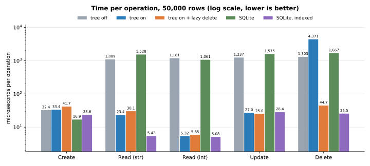
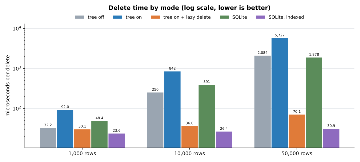
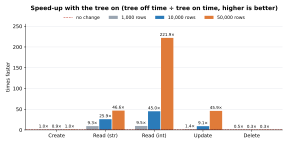
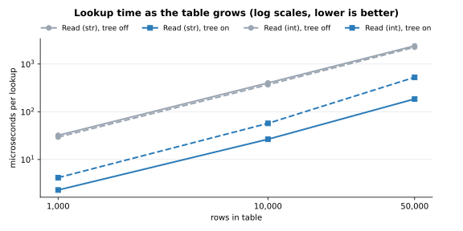
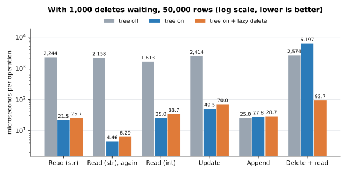

# SiQL (Simple Query Language)


### *A Python API for local tables and data access/searching much like [SQLite](https://sqlite.org/)*
This Python library is intended to make data access and usage simpler with single calls and query chains

## Installation
Requires Python 3.11+. No third-party dependencies.
```
pip install SiQL
```

SiQL has three layers. Use only the ones you need: `import siql` loads just the library, the
interpreter loads the first time it's used, and the server only when you import `siql.server`.

## Command line
```
python -m siql "CREATE TABLE people (name str, age int)"
python -m siql "INSERT INTO people VALUES ('Ann', 31), ('Bob', 25)"
python -m siql "SELECT * FROM people WHERE age > 30"
python -m siql -d data "SHOW FILES"          # -d: folder of table files (default: current folder)
python -m siql -f setup.sql                  # run a script file
python -m siql                               # interactive shell (also installed as `siql`)
```
Separate several statements with `;`. Exit code is 1 if a statement fails.

## 1. Python library
```python
from siql import Table, Database

db = Database("data")                       # folder of .siql table files
people = db.create("people", name=str, age=int)
people.add(name="Ann", age=31)
db.rename("people", "staff")
db.copy("staff", "backup")
db.table("staff").compact()                 # rewrite the file without its change history
print(db.table("staff"))
```

### Search tree
Every `Table` keeps a search tree by default (`Table(tree=True)`), in layers: column name, then the first
character of a string or first digit of a number, then the table's own `Row` and `Cell` objects.
`find`, `select`, `editByName` and the interpreter's `WHERE col = value` use it instead of scanning every row.
It's kept current on every change, including direct `cell.value = ...` assignments, and rebuilt when a table loads.
```python
people.index["name"]["A"]                   # rows whose name starts with "A"
people.find("name", "Ann")                  # indices of matching rows
people.tree = False                         # discard the tree (set True to rebuild it)
```

#### Lazy delete
`Table(lazy_delete=True)` (off by default) queues the tree's cleanup for deleted rows instead of doing it at once.
The row still leaves `rows`, `cols` and the file immediately, so nothing else sees it. In the tree, each of its
cells is queued under the branch it sits in; a search unlinks the queued cells of just the branches it reads, before
reading them, so a lookup never sees a deleted row and never checks branches it doesn't need. Lookups also correct
row positions for queued deletes instead of rebuilding the position map after every delete. The queue empties
itself if it grows past the size of the table, and `table.purge()` empties it on demand. It can also be switched
at any time with `table.lazy_delete = True`.

Without the tree (`tree=False`), `lazy_delete` has no effect: there's no tree cleanup to put off, so deletes work
exactly as normal. Turning the tree on later builds it from the current rows, and lazy deletes apply from then on.

Only the tree's cleanup waits; the delete itself never does. Each delete is written to the table file when it's
made, as the same line it would be without lazy delete, and the queue exists only in memory. So nothing has to run
at shutdown: a process can exit, or be killed, with deletes still waiting, and the next load replays the file
without those rows and builds the tree without them.

#### Performance: tree off vs on vs lazy delete
Each operation timed on tables of 1,000, 10,000 and 50,000 rows (`name` = random 8-letter string,
`n` = row number), with 300 operations of each kind, taking the median of 3 runs.

| Operation | What's timed |
|---|---|
| Create | `table.add(...)`, one row at a time, each saved to the file |
| Read (str) / Read (int) | `table.find("name", value)` / `table.find("n", value)` for an existing value |
| Update | `table.editByName("name", old, new)` (a lookup plus a saved change) |
| Delete | `table.find(...)` then `DropRow` for the match, saved to the file |






| Operation | Rows | Tree off (µs/op) | Tree on (µs/op) | Speed-up | Tree on + lazy delete (µs/op) | Speed-up |
|---|---:|---:|---:|---:|---:|---:|
| Create | 1,000 | 22.9 | 23.6 | 0.97× | 23.1 | 0.99× |
| Create | 10,000 | 27.8 | 35.4 | 0.78× | 28.1 | 0.99× |
| Create | 50,000 | 37.1 | 30.7 | 1.21× | 40.1 | 0.93× |
| Read (str) | 1,000 | 32.2 | 2.3 | 13.98× | 2.2 | 14.43× |
| Read (str) | 10,000 | 402.0 | 26.6 | 15.12× | 23.7 | 16.97× |
| Read (str) | 50,000 | 2,403.8 | 185.5 | 12.96× | 172.7 | 13.92× |
| Read (int) | 1,000 | 29.5 | 4.2 | 7.08× | 4.4 | 6.76× |
| Read (int) | 10,000 | 368.8 | 57.2 | 6.45× | 49.4 | 7.46× |
| Read (int) | 50,000 | 2,251.2 | 526.8 | 4.27× | 693.0 | 3.25× |
| Update | 1,000 | 50.7 | 17.5 | 2.90× | 20.3 | 2.50× |
| Update | 10,000 | 453.6 | 47.0 | 9.65× | 40.5 | 11.20× |
| Update | 50,000 | 2,761.8 | 199.9 | 13.82× | 194.5 | 14.20× |
| Delete | 1,000 | 44.1 | 81.0 | 0.54× | 22.9 | 1.92× |
| Delete | 10,000 | 438.2 | 949.6 | 0.46× | 48.8 | 8.98× |
| Delete | 50,000 | 2,707.5 | 5,414.5 | 0.50× | 219.6 | 12.33× |

What this shows:
- **Reads and updates** are 2.9–15× faster with the tree (more on bigger tables). String columns gain the most,
  because their values spread over ~52 first letters. Integer columns spread over only 10 first digits, and in
  0–50,000 mostly over 1–4.
- **Creates** cost about the same in every mode; the time goes to saving each row to the file.
- **Deletes** are about 2× slower with the plain tree, because removing a row shifts every row after it and the
  map from rows to positions is rebuilt on the next lookup. **Lazy delete** avoids that rebuild, making deletes
  1.9–12× faster than with no tree and 3.5–25× faster than with the plain tree.
- In this table, reads and updates run before any deletes, so nothing is waiting and lazy delete matches the plain
  tree. The next section shows what happens while deletes are waiting.
- Lookups still grow with table size in every mode: the tree narrows the search to one first-character branch
  rather than to the exact value.

#### Reads and writes while deletes are waiting
The same 50,000-row table, but each operation is timed right after 1,000 random rows were deleted (untimed), so
with lazy delete those 1,000 deletes are still waiting in the tree. "Read (str), again" repeats the previous
lookups, and "Delete + read" alternates deleting a random row with looking one up.



| Operation | Tree off (µs/op) | Tree on (µs/op) | Tree on + lazy delete (µs/op) | Lazy vs tree on |
|---|---:|---:|---:|---:|
| Read (str) | 3,764.4 | 226.2 | 257.6 | 0.88× |
| Read (str), again | 3,746.4 | 196.4 | 224.9 | 0.87× |
| Read (int) | 2,930.1 | 694.4 | 866.7 | 0.80× |
| Update | 3,903.5 | 291.3 | 285.7 | 1.02× |
| Append | 29.8 | 34.5 | 37.7 | 0.91× |
| Delete + read | 3,751.6 | 7,135.2 | 336.5 | 21.20× |

What this shows:
- **Lookups with deletes waiting** run at 0.8–1.0× the plain tree's speed. A lookup only deals with the queued
  cells of the branches it reads, so its extra work is proportional to the deletes waiting there, not to the size
  of the branch. Some of the remaining gap is run-to-run noise: appends, which lazy delete doesn't touch, differ by
  a similar amount.
- **Mixed deleting and reading** is where lazy delete pays off: 21× faster than the plain tree and 11× faster
  than no tree, because the plain tree rebuilds its position map after every delete.
- Use lazy delete when deletes are frequent. For tables that are mostly read and rarely deleted from, it makes
  little difference either way.

Measured with siql 0.1.0 on Python 3.14.4, Linux (WSL2), Intel Core Ultra 7 165U. Raw numbers are in
[docs/benchmarks/results.json](docs/benchmarks/results.json). Reproduce with `python benchmarks/crud.py`
(add `--quick` for a short run, or `--replot` to redraw the charts from the saved results); it prints these tables.

## 2. Query interpreter (optional)
```python
from siql import Interpreter

db = Interpreter("data")
db.execute("INSERT INTO people VALUES ('Bob', 25), ('Cy', 40)")
print(db.execute("SELECT name FROM people WHERE age > 30 ORDER BY age DESC"))
```
| Kind  | Statements |
|-------|------------|
| Data  | `INSERT INTO t [(cols)] VALUES (...), ...`<br>`SELECT * \| cols \| COUNT(*) FROM t [WHERE] [ORDER BY col [ASC\|DESC], ...] [LIMIT n [OFFSET m]]`<br>`UPDATE t SET col = value, ... [WHERE]`<br>`DELETE FROM t [WHERE]` |
| Tables | `CREATE TABLE [IF NOT EXISTS] t (col type, ...)`, `DROP TABLE [IF EXISTS] t`<br>`ALTER TABLE t ADD col type \| DROP col \| ALTER col type \| RENAME col TO new`<br>`RENAME TABLE t TO new`, `COPY TABLE t TO new`, `TRUNCATE TABLE t`<br>`SHOW TABLES`, `DESCRIBE t` |
| Files | `USE 'folder'` (switch data folder, created if missing)<br>`SHOW FILES` (table, file path, size, row count)<br>`COMPACT [TABLE t]` (rewrite one or every table file without its change history)<br>`IMPORT 'file.csv' INTO t` (creates `t` with inferred types if it doesn't exist)<br>`EXPORT [TABLE] t TO 'file.csv'` |

`WHERE` supports `= != <> < > <= >=`, `IS [NOT] NULL`, `[NOT] IN (...)`, `[NOT] LIKE`, `AND`, `OR`, `NOT` and parentheses.
Column types: `str`, `int`, `float`, `bool`, `list`, `dict`, `any` (plus SQL aliases like `text`, `integer`, `real`).
In CSV files an empty field is NULL.

## 3. HTTP server (optional)
```
siql-server init                            # writes siql.toml
siql-server serve -c siql.toml              # or: python -m siql.server serve -c siql.toml
```
| Method | Path      | Body                  | Response                                                     |
|--------|-----------|-----------------------|--------------------------------------------------------------|
| GET    | `/health` |                       | `{"status": "ok", "version": "..."}`                         |
| GET    | `/tables` |                       | `{"tables": [...]}`                                          |
| POST   | `/query`  | `{"query": "..."}`     | `{"results": [{"columns", "rows", "rowcount", "message"}]}`  |

```
curl -X POST http://127.0.0.1:8642/query -H "Content-Type: application/json" -d '{"query": "SHOW TABLES"}'
```
Set a token (`token` in `siql.toml`, or the `SIQL_TOKEN` environment variable) to require
`Authorization: Bearer <token>` on everything except `/health`. The server listens on 127.0.0.1 by default;
set a token before binding to another address. It speaks plain HTTP, so put it behind a TLS reverse proxy if
it's reachable over a network. `USE`, `IMPORT` and `EXPORT` are disabled on the server, since they would let
clients read and write files outside the data folder.

Run it as a Linux service with systemd:
```
siql-server systemd -c /srv/siql/siql.toml --user siql -o siql.service
sudo cp siql.service /etc/systemd/system/
sudo systemctl daemon-reload && sudo systemctl enable --now siql
```

## Project layout
```
src/siql/
├── __init__.py          # public API (Interpreter, Command, QueryError load lazily)
├── __main__.py          # command line: python -m siql
├── demo.py              # demo: python -m siql.demo
├── models/              # data structures
│   ├── row.py           # RowStruct, Cell, Row
│   ├── table.py         # Table (including saving to / loading from its .siql file)
│   ├── tree.py          # ColumnTree: the per-column search tree
│   └── diff.py          # diff notation: DiffOp subclasses, TableDiff, commit_line
├── managers/            # file management
│   ├── table_file.py    # table_file
│   └── database.py      # Database: a folder of tables opened by name
├── helpers/             # shared utilities
│   ├── error_handler.py # ErrorHandler
│   ├── format.py        # text table drawing
│   └── types.py         # column type <-> name conversion for table files
├── controllers/         # optional query interpreter
│   ├── parser.py        # tokenizer, parser, QueryError
│   ├── interpreter.py   # Interpreter, Result, Command
│   └── shell.py         # command line and interactive shell (python -m siql / siql)
├── server/              # optional HTTP server
│   ├── config.py        # ServerConfig, siql.toml template
│   ├── app.py           # SiQLServer, serve
│   ├── service.py       # systemd unit generator
│   └── cli.py           # `siql-server` command
└── tests/
    ├── test_core.py         # package layout, models, diff, manager, controller, helpers
    ├── test_persistence.py  # file saving and crash recovery
    ├── test_interpreter.py  # Database, parser, interpreter, management statements, command line
    ├── test_server.py       # HTTP API, config, systemd unit, CLI
    └── test_tree.py         # search tree structure, upkeep and lookups
benchmarks/crud.py           # CRUD timings with the tree on and off; writes docs/benchmarks/
```

## Development
The package itself has no dependencies. Development tools are in `[dependency-groups]` in `pyproject.toml`
(`dev`: build, twine and matplotlib; `bench`: matplotlib only) and need pip 25.1 or newer:
```
python -m venv .venv
.venv/bin/python -m pip install -e . --group dev        # Windows: .venv\Scripts\python
python -m siql.demo                                     # demo
python -m unittest discover -s src/siql/tests -t src -v # tests (from the repository root)
python benchmarks/crud.py                               # benchmarks and charts
```

## Releasing
```
python -m build             # creates dist/*.tar.gz and dist/*.whl
twine check dist/*
twine upload dist/*
```

## License
[MIT](https://github.com/johnchowell/SiQL/blob/master/LICENSE)
