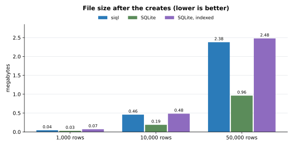

# SiQL (Simple Query Language)


### *A Python API for local tables and data access/searching much like [SQLite](https://sqlite.org/)*
This Python library is intended to make data access and usage simpler with single calls and query chains

## Installation
Requires Python 3.11+. No third-party dependencies. Wheels include an optional C extension for faster searching;
installing from source compiles it if a C compiler is available and otherwise falls back to pure Python.
```
pip install SiQL
```

SiQL has three layers. Use only the ones you need: `import siql` loads just the library, the
interpreter loads the first time it's used, and the server only when you import `siql.server`.

## Command line
```
python -m siql "CREATE TABLE people (name str, age int)"
python -m siql "INSERT INTO people VALUES ('Ann', 31), ('Bob', 25)"
python -m siql "SELECT * FROM people WHERE age > 30"
python -m siql -d data "SHOW FILES"          # -d: folder of table files (default: current folder)
python -m siql -f setup.sql                  # run a script file
python -m siql                               # interactive shell (also installed as `siql`)
```
Separate several statements with `;`. Exit code is 1 if a statement fails.

## 1. Python library
```python
from siql import Table, Database

db = Database("data")                       # folder of .siql table files
people = db.create("people", name=str, age=int)
people.add(name="Ann", age=31)
db.rename("people", "staff")
db.copy("staff", "backup")
db.table("staff").compact()                 # rewrite the file without its change history
print(db.table("staff"))
```

### Search tree
Every `Table` keeps a search tree by default (`Table(tree=True)`), in layers: column name, then the first
character of a string or first digit of a number, then the table's own `Row` and `Cell` objects.
Inside each string or number branch, values are also kept in a skip list: each new value gets a random height and
joins that many "express lanes", placed by comparing it with the values already there. A lookup runs along the
sparsest lane and drops down, jumping over most of the branch, so it takes about log(n) comparisons instead of
checking every value. Values that can't be ordered (`None`, lists, `nan`, ...) sit in their own branch and are checked
one by one.
`find`, `select`, `editByName` and the interpreter's `WHERE col = value` use it instead of scanning every row.
It's kept current on every change, including direct `cell.value = ...` assignments, and rebuilt when a table loads.
```python
people.index["name"]["A"]                   # rows whose name starts with "A"
people.find("name", "Ann")                  # indices of matching rows
people.tree = False                         # discard the tree (set True to rebuild it)
```

#### Lazy delete
`Table(lazy_delete=True)` (off by default) queues the tree's cleanup for deleted rows instead of doing it at once.
The row still leaves `rows`, `cols` and the file immediately, so nothing else sees it. In the tree, each of its
cells is queued under the branch it sits in; a search unlinks the queued cells of just the branches it reads, before
reading them, so a lookup never sees a deleted row and never checks branches it doesn't need. Lookups also correct
row positions for queued deletes instead of rebuilding the position map after every delete. The queue empties
itself if it grows past the size of the table, and `table.purge()` empties it on demand. It can also be switched
at any time with `table.lazy_delete = True`.

Without the tree (`tree=False`), `lazy_delete` has no effect: there's no tree cleanup to put off, so deletes work
exactly as normal. Turning the tree on later builds it from the current rows, and lazy deletes apply from then on.

Only the tree's cleanup waits; the delete itself never does. Each delete is written to the table file when it's
made, as the same line it would be without lazy delete, and the queue exists only in memory. So nothing has to run
at shutdown: a process can exit, or be killed, with deletes still waiting, and the next load replays the file
without those rows and builds the tree without them.

#### Performance: tree off vs on vs lazy delete, and SQLite
Each operation timed on tables of 1,000, 10,000 and 50,000 rows (`name` = random 8-letter string,
`n` = row number), with 300 operations of each kind, taking the median of 3 runs. siql ran with its C search
functions. SQLite (3.46.1, through Python's `sqlite3`) ran the same steps with every statement saved on its own
(autocommit) and `synchronous=OFF`, which matches siql's durability: changes survive a crashed process but not a
power cut. "SQLite, indexed" also has an index on each column.

| Operation | What's timed in siql | What's timed in SQLite |
|---|---|---|
| Create | `table.add(...)`, one row at a time, each saved to the file | `INSERT`, one row per statement |
| Read (str) / Read (int) | `table.find("name", value)` / `table.find("n", value)` | `SELECT rowid ... WHERE name = ?` / `n = ?` |
| Update | `table.editByName("name", old, new)` | `UPDATE ... SET name = ? WHERE name = ?` |
| Delete | `table.find(...)` then `DropRow` for the match | `DELETE ... WHERE name = ?` |


| Operation | Rows | Tree off (µs/op) | Tree on (µs/op) | Tree on + lazy delete (µs/op) | SQLite (µs/op) | SQLite, indexed (µs/op) |
|---|---:|---:|---:|---:|---:|---:|
| Create | 1,000 | 23.7 | 31.6 | 28.0 | 19.5 | 25.2 |
| Create | 10,000 | 26.9 | 36.9 | 36.8 | 19.6 | 26.5 |
| Create | 50,000 | 40.7 | 43.9 | 65.3 | 19.5 | 26.7 |
| Read (str) | 1,000 | 19.2 | 2.2 | 2.3 | 45.2 | 5.7 |
| Read (str) | 10,000 | 214.6 | 8.5 | 9.5 | 370.4 | 7.1 |
| Read (str) | 50,000 | 1,764.6 | 30.4 | 31.0 | 1,861.2 | 6.7 |
| Read (int) | 1,000 | 15.7 | 2.0 | 2.2 | 27.2 | 5.1 |
| Read (int) | 10,000 | 191.1 | 4.7 | 4.3 | 247.9 | 5.9 |
| Read (int) | 50,000 | 1,182.3 | 6.3 | 6.7 | 1,268.1 | 6.0 |
| Update | 1,000 | 42.8 | 27.3 | 21.3 | 56.4 | 28.4 |
| Update | 10,000 | 257.9 | 25.2 | 30.1 | 408.7 | 28.5 |
| Update | 50,000 | 2,003.4 | 36.4 | 31.5 | 1,922.9 | 32.3 |
| Delete | 1,000 | 32.2 | 92.0 | 30.1 | 48.4 | 23.6 |
| Delete | 10,000 | 250.4 | 842.2 | 36.0 | 390.9 | 26.4 |
| Delete | 50,000 | 2,083.7 | 5,727.2 | 70.1 | 1,877.8 | 30.9 |

What this shows:
- **Reads and updates** are 1.6–190× faster with the tree than without, and the gap widens as the table grows.
  Without the tree, lookup time grows in step with the number of rows; with it, much more slowly, because the skip
  lists jump over most of each branch.
- **Against SQLite**: with the tree on, siql matches indexed SQLite for integer lookups (6.3 vs 6.0 µs at 50,000
  rows) and updates (31–36 vs 32 µs), and beats it on small tables. Lazy deletes are 1.3–2.3× slower and creates
  1.3–2.3× slower. Without the tree, siql and unindexed SQLite both check every row and take about the same time.
- **String lookups seem to grow with table size, but mostly don't**: they run first after the creates, and the
  first lookup builds a map of row positions over the whole table (about 6,300 µs at 50,000 rows). Spread over the
  300 string lookups, that one-time cost is about 21 of their 30 µs. Measured separately, lookups after it take
  8.0 µs for strings and 6.5 µs for integers, about 1.2× and 1.1× indexed SQLite. Integer lookups, timed next,
  reuse the map.
- **Creates** are about 10–60% slower with the tree, since each new value is also placed in the skip lists.
  Most of the time still goes to saving each row to the file.
- **Deletes** are about 3× slower with the plain tree, because removing a row shifts every row after it and the
  map from rows to positions is rebuilt on the next lookup. **Lazy delete** avoids that rebuild, making deletes
  1.1–30× faster than with no tree and 3–82× faster than with the plain tree.
- In this table, reads and updates run before any deletes, so nothing is waiting and lazy delete matches the plain
  tree. The section after next shows what happens while deletes are waiting.

#### Storage


| Rows | siql (MB) | SQLite (MB) | SQLite, indexed (MB) |
|---:|---:|---:|---:|
| 1,000 | 0.04 | 0.03 | 0.07 |
| 10,000 | 0.46 | 0.19 | 0.48 |
| 50,000 | 2.38 | 0.96 | 2.48 |

siql's file is about 2.5× the size of unindexed SQLite's: it's readable text that repeats the column names on
every row, while SQLite stores rows in compact binary. It's about the same size as indexed SQLite, because siql's
search tree lives in memory and is rebuilt when a table loads, while SQLite keeps its indexes in the file.
siql keeps the whole table in memory; SQLite reads from disk as needed. Memory use wasn't measured.

#### Reads and writes while deletes are waiting
The same 50,000-row table, but each operation is timed right after 1,000 random rows were deleted (untimed), so
with lazy delete those 1,000 deletes are still waiting in the tree. "Read (str), again" repeats the previous
lookups, and "Delete + read" alternates deleting a random row with looking one up.


| Operation | Tree off (µs/op) | Tree on (µs/op) | Tree on + lazy delete (µs/op) | Lazy vs tree on |
|---|---:|---:|---:|---:|
| Read (str) | 2,015.0 | 25.1 | 26.1 | 0.96× |
| Read (str), again | 2,033.6 | 6.6 | 6.8 | 0.96× |
| Read (int) | 1,483.3 | 23.9 | 37.8 | 0.63× |
| Update | 2,222.2 | 55.2 | 70.4 | 0.78× |
| Append | 29.9 | 34.2 | 39.0 | 0.88× |
| Delete + read | 2,150.8 | 6,059.9 | 102.2 | 59.27× |

What this shows:
- **The first lookups after a batch of lazy deletes** are up to 1.6× slower than with the plain tree. They do the
  cleanup the plain tree did at delete time: unlinking each waiting cell from its branch's skip list, which costs
  about log(n) comparisons per cell. A lookup only cleans the branches it reads.
- **After that, lookups are as fast as the plain tree**: repeating the same reads takes the same time.
- **Appends** are unaffected, apart from run-to-run noise.
- **Mixed deleting and reading** is where lazy delete pays off: 59× faster than the plain tree and 21× faster
  than no tree, because the plain tree rebuilds its position map after every delete.
- Use lazy delete when deletes are frequent and mixed with reads. For tables that delete in occasional large
  batches and then read a lot, the plain tree spreads less cleanup over the reads that follow.

Measured with siql 1.0.0 (C search functions on) and SQLite 3.46.1 on Python 3.14.4, Linux (WSL2), Intel Core
Ultra 7 165U. Raw numbers are in
[docs/benchmarks/results.json](docs/benchmarks/results.json). Reproduce with `python benchmarks/crud.py`
(add `--quick` for a short run, or `--replot` to redraw the charts from the saved results); it prints these tables.

#### C search functions
The skip lists, whole-column scans (`=`, `!=`, `<`, `<=`, `>`, `>=`, `IS [NOT] NULL`, `LIKE`) and value extraction
for `ORDER BY` have C versions in `siql._speedups`, built against the stable ABI so one compiled module per
platform works on Python 3.11 and later. They're used automatically when compiled; `siql.helpers.search.SPEEDUPS`
says whether they're active, and `SIQL_PURE_PYTHON=1` forces the identical Python versions. The tests check that
both versions give the same answers.

The interpreter answers `WHERE` conditions on columns with those scans and the search tree, combining `AND`, `OR`
and `NOT` as sets of row numbers, instead of building and testing a dict for every row. `ORDER BY` sorts row
numbers and builds rows only for the ones returned. Those changes help with or without C, and are the bigger
win; the C versions add a smaller gain on top. 20,000-row table unless noted (µs per operation):

| Operation | Before | Pure Python now | With C |
|---|---:|---:|---:|
| `SELECT ... WHERE n > x` | 12,750 | 700–1,000 | 530–780 |
| `SELECT COUNT(*) ... WHERE name LIKE 'a%'` | 15,395 | 2,680–3,530 | 2,280–3,740 |
| `SELECT ... ORDER BY name LIMIT 5` | 43,217 | 4,880–5,020 | 5,210–5,320 |
| `find` with the tree off (50,000 rows) | 1,867 | 1,920–2,460 | 1,190–1,330 |
| Load a 50,000-row table (per row) | 27–37 | 37–38 | 25–28 |
| `find` with the tree on (50,000 rows) | 7–10 | 5–10 | 3–7 |

Ranges are from three runs. Each value lives in its own Python `Cell` object, so even in C every comparison
goes through an attribute lookup and a Python-level comparison; that caps the C speed-up at about 1.2–1.9×.
Loading is still dominated by parsing each line of the table file with `ast.literal_eval`.

## 2. Query interpreter (optional)
```python
from siql import Interpreter

db = Interpreter("data")
db.execute("INSERT INTO people VALUES ('Bob', 25), ('Cy', 40)")
print(db.execute("SELECT name FROM people WHERE age > 30 ORDER BY age DESC"))
```
| Kind  | Statements |
|-------|------------|
| Data  | `INSERT INTO t [(cols)] VALUES (...), ...`<br>`SELECT * \| cols \| COUNT(*) FROM t [WHERE] [ORDER BY col [ASC\|DESC], ...] [LIMIT n [OFFSET m]]`<br>`UPDATE t SET col = value, ... [WHERE]`<br>`DELETE FROM t [WHERE]` |
| Tables | `CREATE TABLE [IF NOT EXISTS] t (col type, ...)`, `DROP TABLE [IF EXISTS] t`<br>`ALTER TABLE t ADD col type \| DROP col \| ALTER col type \| RENAME col TO new`<br>`RENAME TABLE t TO new`, `COPY TABLE t TO new`, `TRUNCATE TABLE t`<br>`SHOW TABLES`, `DESCRIBE t` |
| Files | `USE 'folder'` (switch data folder, created if missing)<br>`SHOW FILES` (table, file path, size, row count)<br>`COMPACT [TABLE t]` (rewrite one or every table file without its change history)<br>`IMPORT 'file.csv' INTO t` (creates `t` with inferred types if it doesn't exist)<br>`EXPORT [TABLE] t TO 'file.csv'` |

`WHERE` supports `= != <> < > <= >=`, `IS [NOT] NULL`, `[NOT] IN (...)`, `[NOT] LIKE`, `AND`, `OR`, `NOT` and parentheses.
Column types: `str`, `int`, `float`, `bool`, `list`, `dict`, `any` (plus SQL aliases like `text`, `integer`, `real`).
In CSV files an empty field is NULL.

## 3. HTTP server (optional)
```
siql-server init                            # writes siql.toml
siql-server serve -c siql.toml              # or: python -m siql.server serve -c siql.toml
```
| Method | Path      | Body                  | Response                                                     |
|--------|-----------|-----------------------|--------------------------------------------------------------|
| GET    | `/health` |                       | `{"status": "ok", "version": "..."}`                         |
| GET    | `/tables` |                       | `{"tables": [...]}`                                          |
| POST   | `/query`  | `{"query": "..."}`     | `{"results": [{"columns", "rows", "rowcount", "message"}]}`  |

```
curl -X POST http://127.0.0.1:8642/query -H "Content-Type: application/json" -d '{"query": "SHOW TABLES"}'
```
Set a token (`token` in `siql.toml`, or the `SIQL_TOKEN` environment variable) to require
`Authorization: Bearer <token>` on everything except `/health`. The server listens on 127.0.0.1 by default;
set a token before binding to another address. It speaks plain HTTP, so put it behind a TLS reverse proxy if
it's reachable over a network. `USE`, `IMPORT` and `EXPORT` are disabled on the server, since they would let
clients read and write files outside the data folder.

Run it as a Linux service with systemd:
```
siql-server systemd -c /srv/siql/siql.toml --user siql -o siql.service
sudo cp siql.service /etc/systemd/system/
sudo systemctl daemon-reload && sudo systemctl enable --now siql
```

## Project layout
```
src/siql/
├── __init__.py          # public API (Interpreter, Command, QueryError load lazily)
├── __main__.py          # command line: python -m siql
├── _speedups.c          # optional C versions of the search functions in helpers/search.py
├── demo.py              # demo: python -m siql.demo
├── models/              # data structures
│   ├── row.py           # RowStruct, Cell, Row
│   ├── table.py         # Table (including saving to / loading from its .siql file)
│   ├── tree.py          # ColumnTree, its branches and their skip lists: the per-column search tree
│   └── diff.py          # diff notation: DiffOp subclasses, TableDiff, commit_line
├── managers/            # file management
│   ├── table_file.py    # table_file
│   └── database.py      # Database: a folder of tables opened by name
├── helpers/             # shared utilities
│   ├── error_handler.py # ErrorHandler
│   ├── format.py        # text table drawing
│   ├── search.py        # skip list and column scans (Python versions, and loads the C ones)
│   └── types.py         # column type <-> name conversion for table files
├── controllers/         # optional query interpreter
│   ├── parser.py        # tokenizer, parser, QueryError
│   ├── interpreter.py   # Interpreter, Result, Command
│   └── shell.py         # command line and interactive shell (python -m siql / siql)
├── server/              # optional HTTP server
│   ├── config.py        # ServerConfig, siql.toml template
│   ├── app.py           # SiQLServer, serve
│   ├── service.py       # systemd unit generator
│   └── cli.py           # `siql-server` command
└── tests/
    ├── test_core.py         # package layout, models, diff, manager, controller, helpers
    ├── test_persistence.py  # file saving and crash recovery
    ├── test_interpreter.py  # Database, parser, interpreter, management statements, command line
    ├── test_speedups.py     # C vs Python search functions; scan-based WHERE and ORDER BY
    ├── test_server.py       # HTTP API, config, systemd unit, CLI
    └── test_tree.py         # search tree structure, upkeep and lookups
benchmarks/crud.py           # CRUD timings with the tree on and off; writes docs/benchmarks/
```

## Development
The package itself has no dependencies. Development tools are in `[dependency-groups]` in `pyproject.toml`
(`dev`: build, twine and matplotlib; `bench`: matplotlib only) and need pip 25.1 or newer:
```
python -m venv .venv
.venv/bin/python -m pip install -e . --group dev        # Windows: .venv\Scripts\python
python -m siql.demo                                     # demo
python -m unittest discover -s src/siql/tests -t src -v # tests (from the repository root)
python benchmarks/crud.py                               # benchmarks and charts
```
The editable install compiles the C extension (gcc/clang, or MSVC on Windows). Run the tests with
`SIQL_PURE_PYTHON=1` as well to cover the Python fallback.

## Releasing
```
python -m build             # creates dist/*.tar.gz and a dist/*.whl for this platform
twine check dist/*
twine upload dist/*
```
The wheel now contains compiled code, so it only fits the platform that built it (for example
`cp311-abi3-win_amd64`). Users on other platforms install from the source package, which compiles the extension
or falls back to pure Python. Building wheels for Linux, macOS and Windows needs a build matrix such as
[cibuildwheel](https://cibuildwheel.pypa.io/).

## License
[MIT](https://github.com/johnchowell/SiQL/blob/master/LICENSE)
